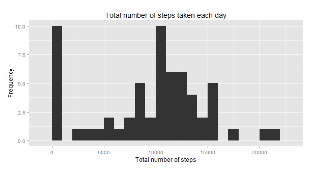
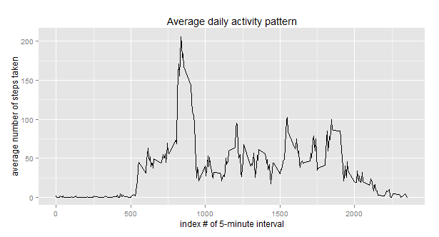
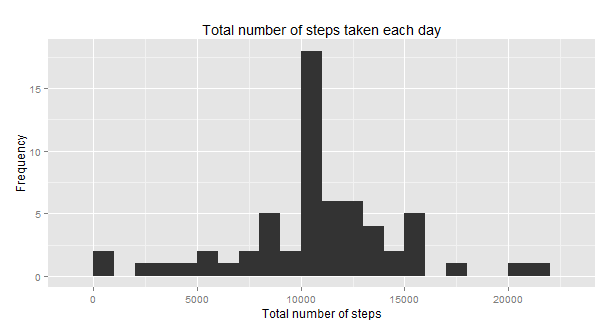
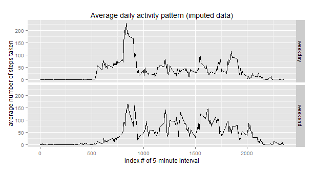

## Data description

The data for this assignment was downloaded from the course web site. There are a total of 17,568 observations in this dataset and includes the following variables:

* steps: Number of steps taking in a 5-minute interval (missing values are coded as `NA`)

* date: The date on which the measurement was taken in YYYY-MM-DD format

* interval: Identifier for the 5-minute interval in which measurement was taken


## Loading and pre-processing the data

```{r}
unzip(zipfile = "repdata-data-activity.zip")
data <- read.csv("activity.csv")
```

## What is mean total number of steps taken per day?

```{r}
library(ggplot2)
total.steps <- tapply(data$steps, data$date, FUN = sum, na.rm = TRUE)
qplot(total.steps, 
      binwidth = 1000, 
      main = "Total number of steps taken each day",
      xlab = "Total number of steps",
      ylab = "Frequency")
mean(total.steps, na.rm = TRUE)
median(total.steps, na.rm = TRUE)
```



The mean is 9354 and median is 10395.


## What is the average daily activity pattern?

```{r}
library(ggplot2)
steps.per.interval <- aggregate(x = list(steps = data$steps),
                                by = list(interval = data$interval),
                                FUN = mean, 
                                na.rm = TRUE)
ggplot(data = steps.per.interval, aes(x = interval, y = steps)) +
        geom_line() +
        xlab("index # of 5-minute interval") +
        ylab("average number of steps taken") + 
        ggtitle("Average daily activity pattern")
```



Which 5-minute interval, on average across all the days in the dataset, contains the maximum number of steps?

```{r}
steps.per.interval[which.max(steps.per.interval$steps), ]
```

The **835th interval** has the maximum of steps (206).


## Imputing missing values

There are many days/intervals where there are missing values (coded as `NA`). The presence of missing days may introduce bias into some calculations or summaries of the data.

#### 1. What's the total number of missing values in the dataset (i.e. the total number of rows with NAs)?

```{r}
missing <- is.na(data$steps)
table(missing)
```

The total number of missing values are **2304**.


#### 2. Devise a strategy to fill in all of the missing values in the dataset.

All of the missing values in the dataset are replace by the mean for that 5-minute interval.

```{r}
# Replace each missing value with the mean value of that 5-minute interval
fill.missing.value <- function(steps, interval) {
    filled <- NA
    if (!is.na(steps)) 
        filled <- c(steps) 
    else 
        filled <- (steps.per.interval[steps.per.interval$interval == interval, "steps"])
    return(filled)
}
imputed.data <- data
imputed.data$steps <- mapply(fill.missing.value, 
                             imputed.data$steps, 
                             imputed.data$interval)
```


#### 3. Create a new dataset that is equal to the original dataset but with the missing data filled in.

This is the `imputed.data` from above.


#### 4. Make a histogram of the total number of steps taken each day and calculate and report the **mean** and **median** total number of steps taken per day. 

```{r}
total.steps <- tapply(imputed.data$steps, imputed.data$date, FUN = sum)
qplot(total.steps, 
      binwidth = 1000, 
      main = "Total number of steps taken each day",
      xlab = "Total number of steps",
      ylab = "Frequency")
mean(total.steps)
median(total.steps)
```



Do these values differ from the estimates from the first part of the assignment? What is the impact of imputing missing data on the estimates of the total daily number of steps?

Yes, these values differ considerably. 
We see that the **mean** and **median** values are higher after imputing missing data. This is because in the original data, there are some days with `steps` values `NA` for any `interval`. The total number of steps taken in such cases were to 0s by default. However, after replacing missing `steps` values with the mean `steps` of their associated `interval` value, we have no more 0 values in the histogram of the total daily number of steps.


## Are there differences in activity patterns between weekdays and weekends?

Let's add a new factor variable in the dataset with two levels - "weekday" and "weekend" indicating whether a given date is a weekday or weekend day.

```{r}
classify.day <- function(date) {
    day <- weekdays(date)
    if (day %in% c("Monday", "Tuesday", "Wednesday", "Thursday", "Friday"))
        return("weekday")
    else if (day %in% c("Saturday", "Sunday"))
        return("weekend")
    else
        stop("invalid date")
}
imputed.data$date <- as.Date(imputed.data$date)
imputed.data$day <- sapply(imputed.data$date, FUN = classify.day)
```

Let's make a panel plot containing a time series line-plot of the 5-minute interval (x-axis) and the average number of steps taken, averaged across all weekday days or weekend days (y-axis).

```{r}
steps.per.interval <- aggregate(steps ~ interval + day, 
                                data = imputed.data, 
                                mean)
ggplot(steps.per.interval, aes(interval, steps)) + 
    geom_line() + 
    facet_grid(day ~ .) +
    xlab("index # of 5-minute interval") + 
    ylab("average number of steps taken") + 
    ggtitle("Average daily activity pattern (imputed data)")
```




